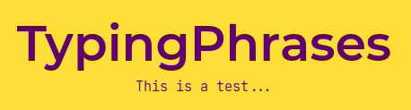
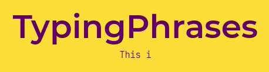

<<<<<<< HEAD
# ⌨ TypingPhrases
=======
# TypingPhrases
>>>>>>> eae541ec4875b312acacee64149c32ee95e7afcf
> The simpliest typing effect npm package 
-- me


## Features
<<<<<<< HEAD
* Speed control 🚶🏃
* Written with TypeScript 💙
=======
* Speed control
* Written with TypeScript
>>>>>>> eae541ec4875b312acacee64149c32ee95e7afcf

# Getting Started
First of all you'll need to install Node and npm to start a project
```
npm init
```
Then with npm you can install `typingphrases` to your project 
```
npm install @raulmar/typingphrases 
```
Now you can import TypingPhrases in your JS file
```
import TypingPhrases from '@raulmar/typingphrases'
```
To initialize and configure TypingPhrases you simply create an instance of `TypingPhrases` with the `PHRASES` the `phraseSpeed` and the `typingSpeed`
```
const startTyping = new TypingPhrases(PHRASES, phraseSpeed, typingSpeed)
```

## Glossary
* **PHRASES:** Reverse array of phrases you want to show on screen
* **phraseSpeed:** Number representing the the time (in ms) each phrase will be on screen (including the typing animation time).
* **typingSpeed:** Number representing the time (in ms) each keystroke will take

## Examples
### Quick setup
```
import TypingPhrases from '@raulmar/typingphrases'

const PHRASES = [
  "'TypingPhrases'",
  "of the library...", 
  "This is a test..."
]

const startTyping = new TypingPhrases(PHRASES, 1500, 50)
```


### Conservative setup
```
const startTyping = new TypingPhrases(PHRASES, 3000, 100)
```

